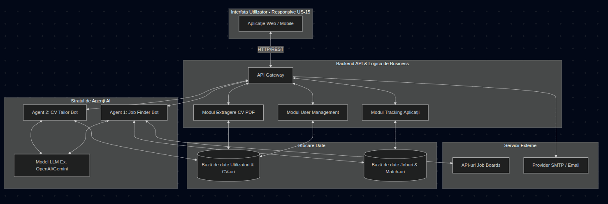
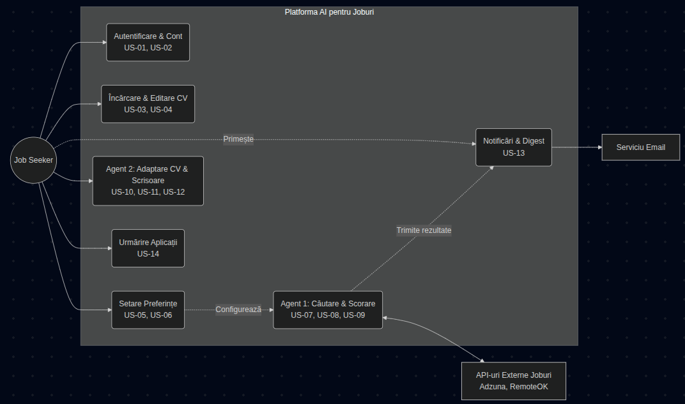
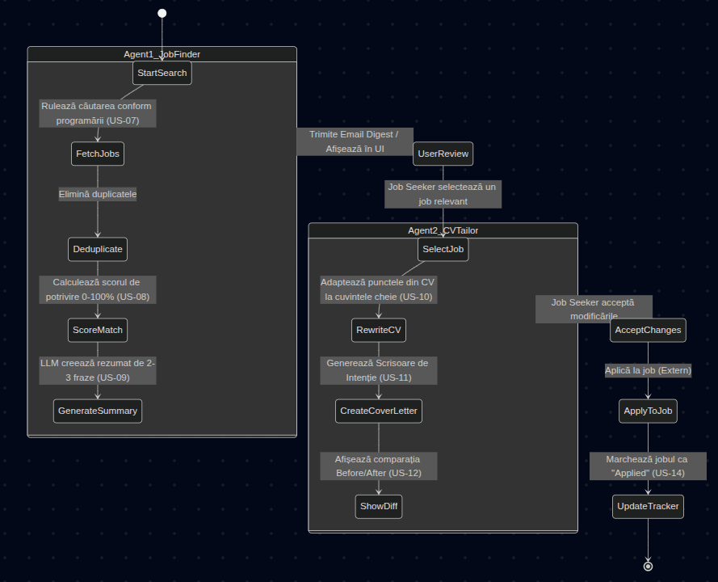

# FindMyJob

A full-stack web application built with **React (Vite)**, **Django**, and **PostgreSQL**, fully containerized with Docker Compose for local development.

## Tech Stack

| Layer | Technology | Version |
|-------|-----------|---------|
| Frontend | React + Vite | React 19, Vite 6 |
| Backend | Django | 5+ |
| Database | PostgreSQL | 15 (Alpine) |
| Containerization | Docker Compose | v2 |

## Project Structure

```
FindMyJob/
├── .env                        # Environment variables (DB creds, Django secret)
├── .gitignore
├── docker-compose.yml          # Orchestrates all 3 services
├── backend/
│   ├── Dockerfile
│   ├── requirements.txt        # Django, psycopg2-binary, django-cors-headers
│   ├── wait-for-db.sh          # Ensures DB is ready before Django starts
│   └── app/
│       ├── manage.py
│       └── config/             # Django project settings
│           ├── settings.py
│           ├── urls.py
│           ├── wsgi.py
│           └── asgi.py
└── frontend/
    ├── Dockerfile
    ├── package.json
    ├── vite.config.js
    ├── index.html
    └── src/
        ├── main.jsx
        ├── App.jsx
        ├── App.css
        └── index.css
```

## Prerequisites

- [Docker Desktop](https://www.docker.com/products/docker-desktop/) installed and running
- [Git](https://git-scm.com/)

## Getting Started

### 1. Clone the repository

```bash
git clone https://github.com/your-username/FindMyJob.git
cd FindMyJob
```

### 2. Configure environment variables

The `.env` file is included with development defaults. Review and update if needed:

```env
POSTGRES_DB=findmyjob_db
POSTGRES_USER=findmyjob_user
POSTGRES_PASSWORD=findmyjob_secret_password
DJANGO_SECRET_KEY=django-insecure-dev-key-change-in-production-abc123xyz
DJANGO_DEBUG=True
```

> ⚠️ **Never commit the `.env` file to version control with real credentials.** It is already listed in `.gitignore`.

### 3. Build and start all services

```bash
docker compose up --build
```

This will:

1. **Pull** the `postgres:15-alpine` image and start the database
2. **Build** the Django backend image, wait for PostgreSQL to be ready, run migrations, and start the dev server
3. **Build** the Vite frontend image, install npm dependencies, and start the dev server

### 4. Access the application

| Service | URL |
|---------|-----|
| React Frontend | [http://localhost:5173](http://localhost:5173) |
| Django Backend | [http://localhost:8000](http://localhost:8000) |
| Django Admin | [http://localhost:8000/admin](http://localhost:8000/admin) |

### 5. Create a Django superuser (optional)

```bash
docker compose exec backend python manage.py createsuperuser
```

## Development Workflow

### Hot Reloading

Both the frontend and backend support **hot reloading** — your changes appear instantly without rebuilding containers:

- **Frontend**: Edit any file in `frontend/src/` → the browser updates automatically via Vite HMR
- **Backend**: Edit any `.py` file in `backend/app/` → Django's dev server auto-restarts

### Common Commands

```bash
# Start all services
docker compose up

# Start in detached mode (background)
docker compose up -d

# Rebuild images (after changing Dockerfile or dependencies)
docker compose up --build

# Stop all services
docker compose down

# Stop and remove the database volume (fresh database)
docker compose down -v

# View logs for a specific service
docker compose logs -f backend
docker compose logs -f frontend
docker compose logs -f db

# Run Django management commands
docker compose exec backend python manage.py makemigrations
docker compose exec backend python manage.py migrate
docker compose exec backend python manage.py shell

# Access the PostgreSQL database shell
docker compose exec backend python manage.py dbshell

# Install a new npm package
docker compose exec frontend npm install <package-name>

# Install a new Python package (then add to requirements.txt and rebuild)
docker compose exec backend pip install <package-name>
```

### Adding Python Dependencies

1. Add the package to `backend/requirements.txt`
2. Rebuild the backend: `docker compose up --build backend`

### Adding npm Dependencies

1. Run: `docker compose exec frontend npm install <package-name>`
2. The `package.json` and `package-lock.json` are synced via the volume mount

## Architecture

```
┌──────────────┐     ┌──────────────┐     ┌──────────────┐
│   Frontend   │────▶│   Backend    │────▶│  PostgreSQL   │
│  React/Vite  │     │    Django    │     │    Database   │
│  :5173       │     │  :8000       │     │  :5432       │
└──────────────┘     └──────────────┘     └──────────────┘
     CORS                  │
  configured          reads .env
                     for DB creds
```

- The **frontend** communicates with the backend via REST API calls
- **CORS** is configured to allow requests from `localhost:5173`
- The **backend** reads database credentials from environment variables
- A **health check** + wait script ensures Django only starts after PostgreSQL is ready
- All services use **volume mounts** for a seamless development experience

## Diagrame

### Arhitectura componentelor



### Diagrama de context



### Workflow



## License

This project is licensed under the MIT License.
